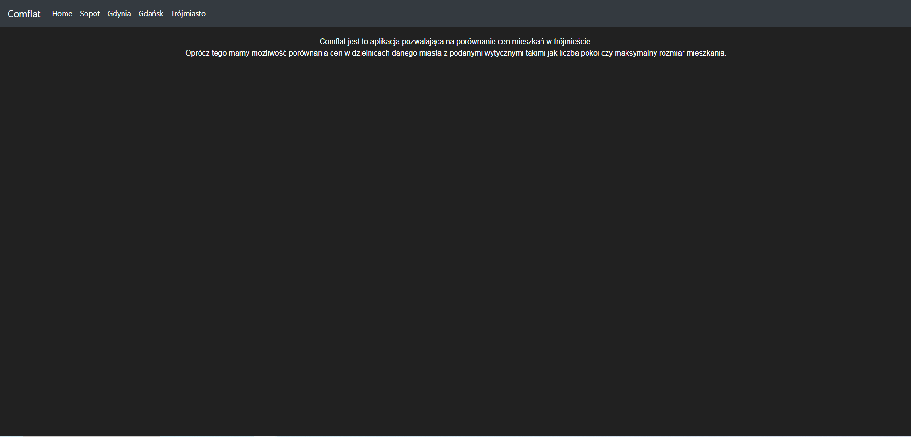
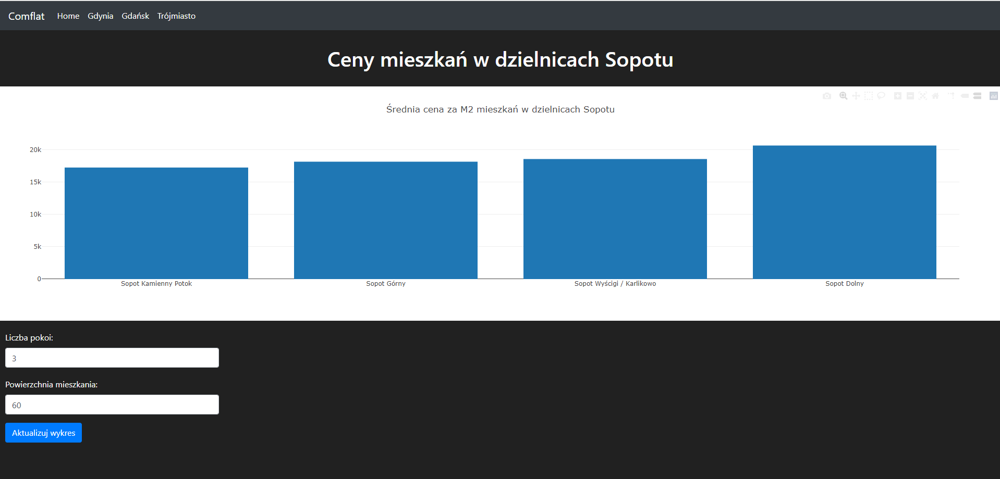
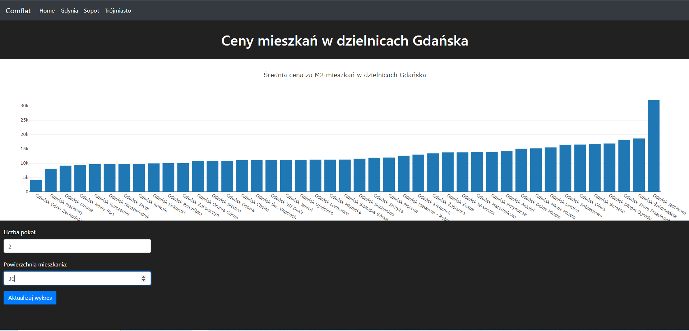
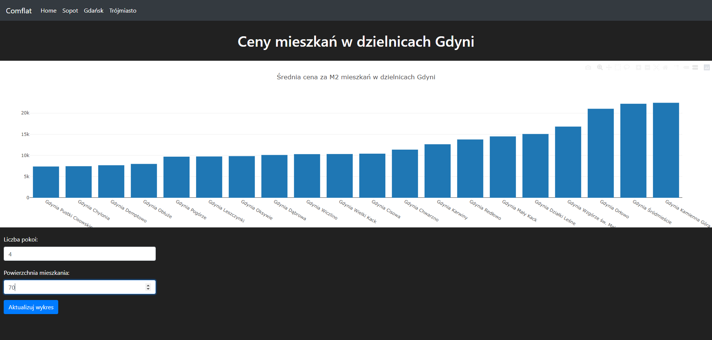
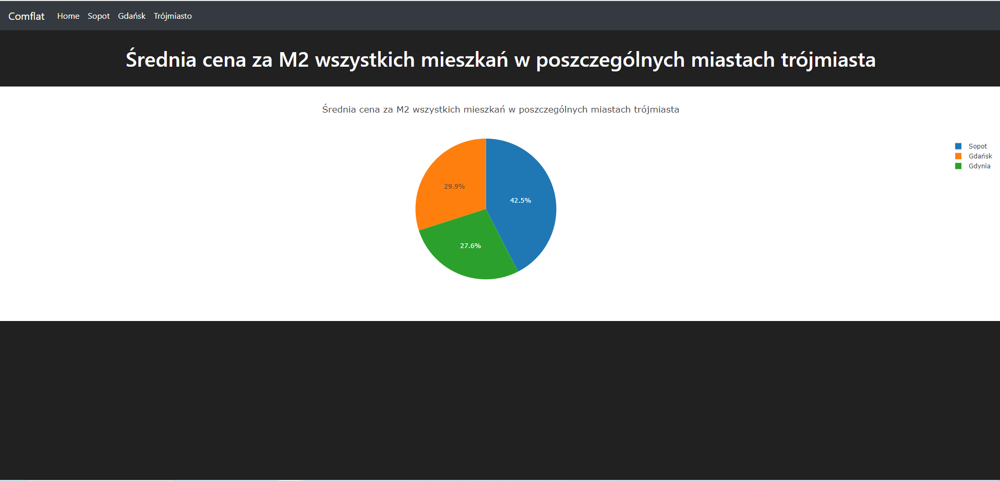

# Dokumentacja Aplikacji porównującej ceny mieszkań w trójmieście
 
> Comflat jest to aplikacja pozwalająca na porównanie cen mieszkań za m2 w trójmieście.
Oprócz tego mamy mozliwość porównania cen w dzielnicach danego miasta z podanymi wytycznymi takimi jak liczba pokoi czy maksymalny rozmiar mieszkania.
 
## Spis Treści
* [Informacje Ogólne](#informacje-ogólne)
* [Technologie Użyte](#technologie-użyte)
* [Funkcjonalności](#funkcjonalności)
* [Zrzuty Ekranu](#zrzuty-ekranu)
* [Instalacja](#instalacja)
* [Jak Korzystać](#jak-korzystać)
* [Status Projektu](#status-projektu)
* [Twórcy](#twórcy)
 
## Informacje Ogólne
- Celem aplikacji jest pomoc w znalezieniu dzielnic, w których ceny mieszkań są tańsze.
- Umożliwia użytkownikom podgląd cen mieszkań za m2 w różnych dzielnicach Sopotu, Gdańska i Gdyni. Można również porównać ceny mieszkań między miastami.
- Aplikacja zawiera funkcjonalności takie jak sprawdzenie cen z filtrowanie liczby pokoi oraz maksymalny rozmiar mieszkania.
 
## Technologie Użyte
- Python
- Pandas
- Django
- Flask
- Bootstrap
- MS SQL
- Visual Studio Code
 
## Funkcjonalności
- Porównanie cen mieszkań za m2 w dzielnicach Sopotu, Gdyni i Gdańska
- Wybór jednego z trzech miast i porównanie cen mieszkań za m2 w zależności od liczby pokoi oraz powierzchni
- Porównanie ogólne cen mieszkań za m2 w trójmieście
 
## Zrzuty Ekranu

**Strona główna**

**Sopot**

**Gdańsk**

**Gdynia**

**Trójmiasto**

 
## Instalacja
Aby uruchomić projekt lokalnie:
1. Musimy uruchomić tricity_apartment.py `python tricity_apartment.py` (Wymagana jest zmiana lokalizacji bazy danych na swoją lokalną)
2. Po zebraniu informacji i obróbce danych mamy je w swojej bazie
3. Następnie uruchamiamy terminal i wpisujem `python app.py`
4. `http://127.0.0.1:5000`
 
## Jak Korzystać
- Wchodząc na stronę mamy zakładki w zależności na której jesteśmy (Sopot, Gdynia, Gdańsk, Trójmiasto).
- Sopot, Gdynia, Gdańsk możemy przefilrować według własnego uznania (liczba pokoi , powierzchnia)
- Potem możemy zobaczyć w jakich dzielnicach za m2 jest najtaniej, a wktórej najdrożej
 
## Status Projektu
Projekt jest w trakcie rozwoju.
 
## Twórcy
- Projekt stworzony przez [@VVNorbi](https://github.com/VVNorbi).
